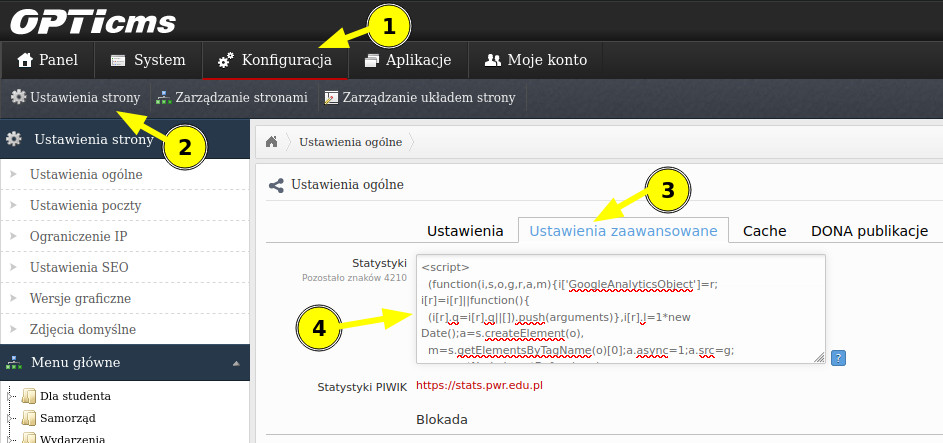

# Usprawnienia

## Instrukcja instalacji

Po zalogowaniu do panelu CMS strony należy wejść po kolei zaczynając od paska nawigacji:

`Konfiguracja -> Ustawienia strony -> Ustawienia zaawansowane`.

Kod należy dodać w polu o nazwie `Statystyki`, zaraz po innych wstawionych tam skryptach, a następnie zapisać stronę.

### Instrukcja krok po kroku

## Lista usprawnień

- [fix: nieczytelny wygląd strony](./fix-design)
- [fix: wyświetlanie aktualności](./fix-news-visibility)
