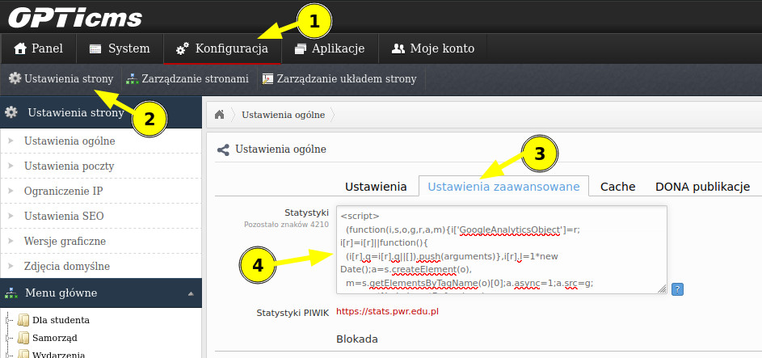

# Fix News Visibility

Poniższy kod służy do naprawienia niewyświetlających się aktualności na stronie głównej.

```html
<script>
    document.addEventListener("DOMContentLoaded", () => {
        let loadMoreNews = document.getElementById('loadMoreNews');
        if (loadMoreNews !== null) {
            loadMoreNews.click();
        }
    });
</script>
```

## Instrukcja instalacji

Po zalogowaniu do panelu CMS strony należy wejść po kolei zaczynając od paska nawigacji: 

`Konfiguracja -> Ustawienia strony -> Ustawienia zaawansowane`.

Kod należy dodać w polu o nazwie `Statystyki`, zaraz po innych wstawionych tam skryptach, a następnie zapisać stronę.

### Instrukcja krok po kroku

