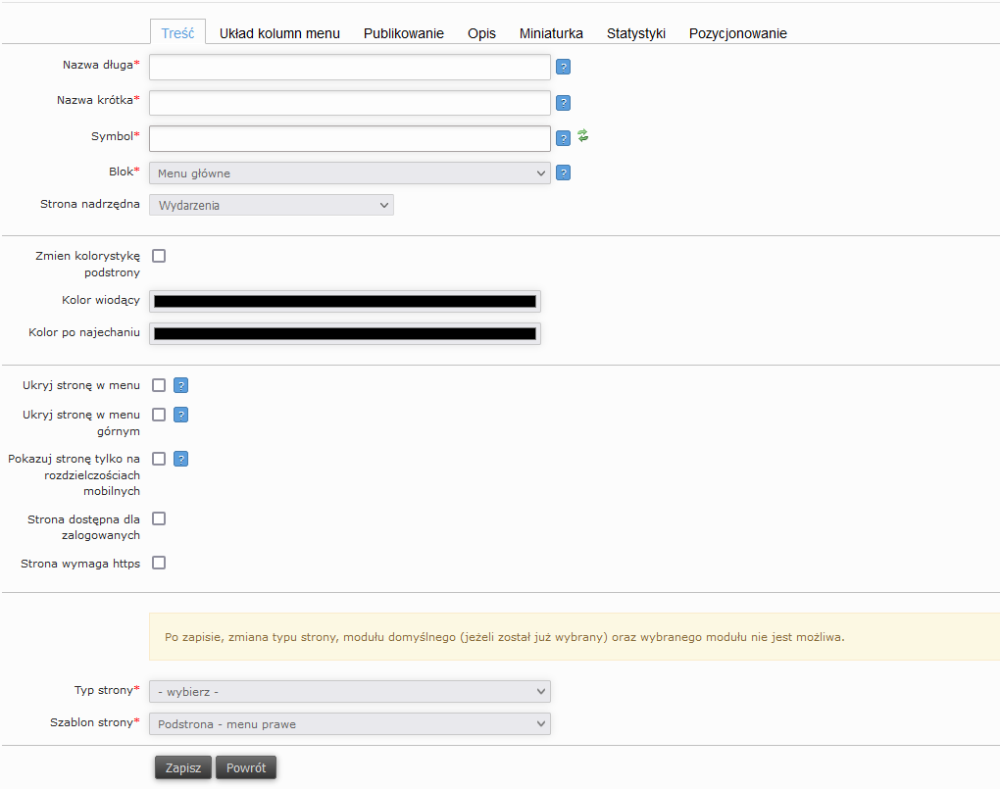

# Instructions

Poniżej znajduje się spis instrukcji z obsługi optiCMS.

## Spis treści

# Dodawanie stron
## Treść
Aby utworzyć stronę należy znaleźć w menu po lewej stronie folder do którego ma należeć tworzona strona, kliknąć na niego prawym przyciskiem myszy i wybrać "dodaj podstronę"

- Nazwa długa - nazwa wyświetlająca się na górze strony po wejściu na nią
- Nazwa krótka - nazwa wyświetlająca się w menu nad stroną
- Symbol - url strony

- Typ strony
  - Moduł - po jego wybraniu pojawi się opcja wybrania konkretnych modułów; zostaną opisane te najczęściej używane
    - Formularz - tworzy stronę z możliwością podpięcia formularza zapisowego na wydarzenie
    - Galeria - tworzy stronę z możliwością wstawienia wielu zdjęć
    - Koła naukowe - tworzy stronę z automatycznie dodaną listą kół naukowych
    - Linki - strona zawierająca kafelki z linkami do innych stron
    - lista stron - pokazuje listę należących do niej podstron
    - pracownicy - umożliwia stworzenie strony zawierającej listę członków danej organizaci
## Opis
Umożliwia dodanie opisu pod tytułem strony

## Miniaturka
Umozliwia zmianę miniaturki widocznej na pasku otwartych stron

## Publikowanie
Po stworzeniu stwony należy odznaczyć pole "szkic" oraz zaznaczyć "zatwierdzone" i "opublikowane".
Możliwe jest także ustawwienie daty automatycznej publikacji i dezaktywacji poprzez pola znajdujące się poniżej
