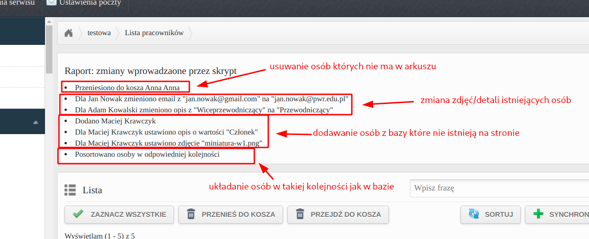

# opti_employee

Narzędzie służące do synchronizacji osób na stronie OptiCMS z bazą danych w arkuszu Google Sheets.



## Konfiguracja
Do działania wymagane są dwa skrypty:
- [Google Sheet AppScript](./opti_employee.gs.js)
- [Userscript](./opti_employee.js)

AppScript należy dodać do odpowiedniego arkusza Google i uruchomić przyciskiem.

Userscript zgodnie z instrukcją w ogólnym README.

## Przykładowe wejście do promptu

Dla testu można używać jsona o wyglądzie:

```json
[
  {
    "firstname": "Adam",
    "lastname": "Kowalski",
    "image": "miniatura-w1.png",
    "description": "Przewodniczący",
    "linkedin_link": "",
    "fb_link": "",
    "url": "",
    "email": "adam.kowalski@pwr.edu.pl",
    "phone": ""
  },
  {
    "firstname": "Jan",
    "lastname": "Nowak",
    "image": "miniatura-w8.png",
    "description": "",
    "linkedin_link": "",
    "fb_link": "",
    "url": "",
    "email": "jan.nowak@pwr.edu.pl",
    "phone": ""
  },
  {
    "firstname": "Anatolia",
    "lastname": "Wójcik",
    "image": "miniaturka_w2_nowa.png",
    "description": "",
    "linkedin_link": "",
    "fb_link": "",
    "url": "",
    "email": "",
    "phone": 500123456
  },
  {
    "firstname": "Maciej",
    "lastname": "Krawczyk",
    "image": "miniatura-w1.png",
    "description": "Członek",
    "linkedin_link": "",
    "fb_link": "",
    "url": "",
    "email": "",
    "phone": ""
  },
  {
    "firstname": "Adam",
    "lastname": "Nowakowski",
    "image": "miniatura-w5.png",
    "description": "",
    "linkedin_link": "",
    "fb_link": "",
    "url": "",
    "email": "",
    "phone": ""
  }
]
```
